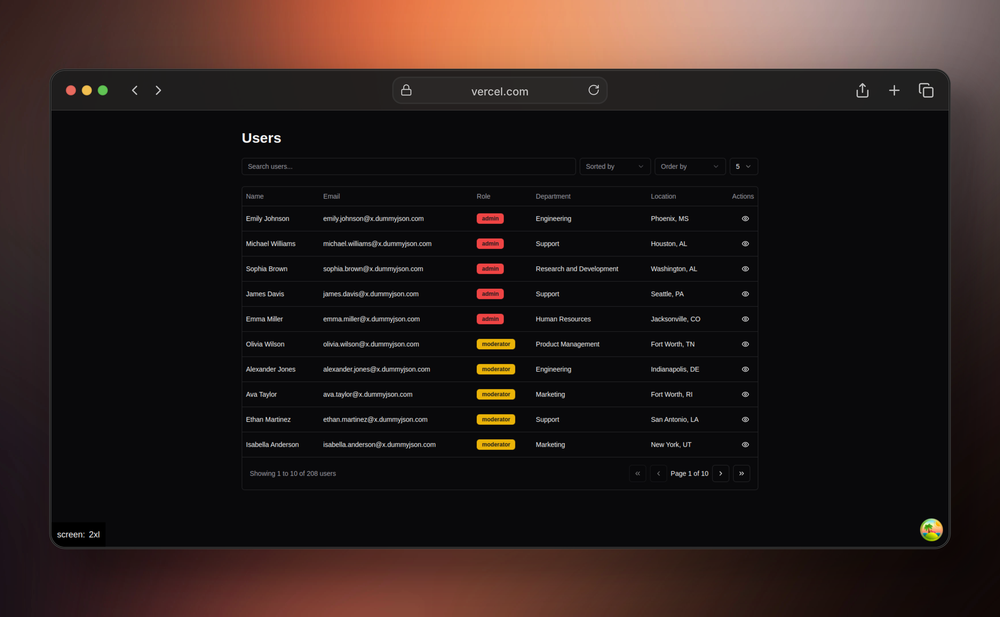

# Next.js, Zustand, TanStack Query, and TailwindCSS Project



## Loyihaning maqsadi:

Ushbu loyiha React, Next.js, Zustand, va TanStack Query yordamida foydalanuvchilar ro'yxatini ko'rsatib, foydalanuvchilarni ismga qarab filtrlash imkoniyatini taqdim etadi. Filtrlangan foydalanuvchilar ro'yxati real vaqtda yangilanadi va bu jarayon Zustand va TanStack Query yordamida amalga oshiriladi.

## Talablar:

- **Node.js** (eng so'nggi versiya)
- **npm** yoki **yarn**
- **TypeScript**
- **Next.js**
- **TanStack Query**
- **Zustand**
- **TailwindCSS**

## O'rnatish va ishlatish:

1. **Loyihani klonlash:**

   GitHub'dan loyihani klonlang:

   ```bash
   git clone https://github.com/muhiddin0/user-list-app-for-test
   ```

2. **Zaruriy paketlarni o'rnatish:**

   Loyihani ishga tushurishdan oldin, kerakli paketlarni o'rnatish uchun quyidagi buyruqni bajarish kerak:

   ```bash
   npm install
   ```

   Yoki agar siz `yarn`dan foydalanayotgan bo'lsangiz:

   ```bash
   yarn install
   ```

3. **Loyihani ishga tushurish:**

   Loyihani rivojlanish muhitida ishga tushurish uchun quyidagi buyruqni bajarish kerak:

   ```bash
   npm run dev
   ```

   Yoki `yarn` bilan:

   ```bash
   yarn dev
   ```

   Dastur https://localhost:3000 manzilida ishga tushadi.

## Asosiy funksionallik:

- **Foydalanuvchilar ro'yxati**: Loyihada foydalanuvchilar ro'yxati https://dummyjson.com/docs/users API manzilidan olinadi va foydalanuvchilar real vaqtda filtrlash imkoniyatiga ega.
- **Ism bo'yicha filtrlash**: UIda ismni kiritish uchun input maydoni mavjud. Kiritilgan filtr qiymati Zustand store'da saqlanadi va ro'yxat shunday yangilanadi, faqat kiritilgan ismni o'z ichiga olgan foydalanuvchilar ko'rsatiladi. Filtrlashda katta-kichik harflar farqi e'tiborsiz.

- **Zustand store**: Filtr holatini saqlash va boshqarish uchun Zustand ishlatiladi.

- **TanStack Query**: API so'rovlarini yuborish va ma'lumotlarni olish uchun TanStack Query ishlatiladi. So'rovlar optimallashtirilgan va filtrlash o'zgarganda avtomatik ravishda yangilanadi.

## Asosiy kod qismlari:

### `useReactQueryAction` - TanStack Query hook

Bu hook API so'rovlarini yuboradi va javobni olish uchun TanStack Query'dan foydalanadi. Parametrlar URLga qo'shiladi va debounce (kutinish) va query parameters yordamida so'rovlar optimallashtiriladi.

```tsx
const { data } = useReactQueryAction<APIResponse>({
  url: `/users${params.q ? "/search" : ""}`,
  debounceTime: 1500,
  query: params,
});
```

### Zustand Store

Zustand store filtr holatini saqlash uchun ishlatiladi. `params` obyekti, filtrlash mezonlarini o'z ichiga oladi va har bir o'zgarish bilan ro'yxatni yangilashga imkon beradi.

```tsx
export const useSearchParamsStore = create<Store>()((set) => ({
  params: defaultSearchParamsValues,
  setParams: (params: Store["params"]) => set(() => ({ params: params })),
}));
```

### Debounce (kutish) funktsiyasi:

Debounce yordamida API so'rovlarini yuborishdan oldin foydalanuvchining kiritgan matniga 1500 ms kutish va so'ngra so'rov yuborish amalga oshiriladi. Bu ma'lumotlar uchun ortiqcha so'rovlarni oldini oladi.

```tsx
const debouncedUrl = debounceTime ? useDebounces(url, debounceTime) : url;
```

## Loyihani rivojlantirish:

Bu loyiha boshlang'ich darajadagi React va Next.js ishlanmalarini o'z ichiga oladi. Filtrlash tizimi, API so'rovlarining optimallashuvi foydalanuvchilarni samarali boshqarish uchun qulay imkoniyatlar yaratadi.

---
